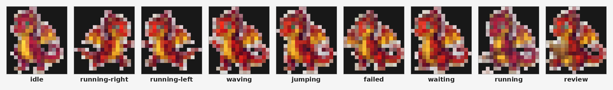

# Phase 5: instalación REAL en `~/.hermes` — Jorgito activo

**Status: PASS.** Primera tarea del proyecto que escribe a propósito en el
perfil de producción del usuario (`/home/chegusan/.hermes/`). Todas las
fases anteriores (0, 2, 2B, Final) usaron exclusivamente el perfil aislado
`HERMES_HOME=/home/chegusan/.hermes-jorgito-test`.

## 0. Qué había antes (verificación previa a instalar)

`hermes pets doctor` contra el perfil real, corrido **antes** de tocar nada:

```
petdex doctor
  pets dir:        /home/chegusan/.hermes/pets
  installed:       0 (none)
  display.pet.enabled:     False
  display.pet.slug:        (unset)
  active (resolved):       (none)
  display.pet.render_mode: auto
  detected graphics:       unicode
  effective mode (TTY):    off
  → no pets installed. Run: hermes pets install boba
```

No había ningún pet instalado ni activo — nada que pisar.

## 1. Backup

Antes de cualquier escritura se copió `~/.hermes/config.yaml` y el
contenido (vacío) de `~/.hermes/pets/` a:

```
/home/chegusan/SGTraining/Jorgito-backups/hermes-real-20260819-104815/
```

Fuera del repo git, nunca comiteado. `config.yaml` pre-instalación:
`md5=66684dd3b378e4584ab08ab097024ed4` (coincide con el baseline conocido de
fases anteriores). Verificado intacto al final de la tarea (paso 8).

**`config.yaml` contiene secretos en texto plano (API keys OpenAI, secreto
de Google) — por eso el backup vive solo en disco local y nunca se tocó su
contenido salvo copiarlo y comparar md5/diff de líneas, nunca se imprimió.**

## 2. Script nuevo: `scripts/install_real_pet.py`

`install_final_atlas_pet.py` (usado en todas las fases previas) está
hardcodeado para **rechazar** el perfil real — es su función correcta y no
se tocó. Se creó un script nuevo y separado, `scripts/install_real_pet.py`,
que hace lo opuesto a propósito:

- Aborta si `CONFIRM_REAL_INSTALL=yes` no está seteado explícitamente.
- Pinea `HERMES_HOME` al perfil real (`Path.home() / ".hermes"`) en vez de
  confiar en que esté sin setear; si `HERMES_HOME` viene seteado a otra
  cosa, aborta.
- Reusa `build_final_atlas.build_and_validate()` (mismo atlas de Fase Final,
  cero regeneración) y `agent.pet.store.register_local_pet()` real de
  Hermes — mismo código de fases anteriores, no reimplementado.
- Vuelve a correr `validate_atlas()` antes de instalar y aborta si no da
  `ok:true, 9/9`.

## 3–4. Instalación

```
$ CONFIRM_REAL_INSTALL=yes /home/chegusan/.hermes/hermes-agent/venv/bin/python3 scripts/install_real_pet.py
HERMES_HOME=/home/chegusan/.hermes (real profile, pinned)
validate_atlas(): ok=True, filled_states=9/9, all_rows_unique=True
registered pet 'jorgito' -> /home/chegusan/.hermes/pets/jorgito/spritesheet.webp
  exists=True generated=True
```

## 5. Activación

```
$ hermes pets select jorgito
✓ active pet set to Jorgito (display.pet.slug=jorgito, enabled)
```

## 6. `hermes pets doctor` (post-instalación)

```
petdex doctor
  pets dir:        /home/chegusan/.hermes/pets
  installed:       1 (jorgito)
  display.pet.enabled:     True
  display.pet.slug:        jorgito
  active (resolved):       jorgito
  display.pet.render_mode: auto
  detected graphics:       unicode
  effective mode (TTY):    off
  ✓ ready
```

`detected graphics: unicode` y `effective mode (TTY): off` son del sandbox
sin TTY real de esta sesión — ver sección "Cómo verlo vos" abajo para lo que
vas a ver en tu propia terminal.

## 7. Evidencia visual — los 9 estados en el perfil real

Igual que en fases anteriores, el sandbox no tiene TTY real, así que
`hermes pets show` se corrió envuelto en `script -qec "..." archivo` para
forzar un TTY falso (con `--once` para que no quede en loop infinito — sin
ese flag, `hermes pets show` anima en loop y no vuelve el control). Se
generaron capturas RAW por estado en
`docs/phase_results/phase5_evidence/raw_<estado>.txt` (9 archivos, uno por
`idle / running-right / running-left / waving / jumping / failed / waiting
/ running / review`, todos exit=0).

Además, con `scripts/render_real_pet_contact_sheet.py` (contraparte
read-only de `render_final_atlas_pet.py`, pineada también al perfil real) se
generó el contact sheet final leyendo el pet ya instalado en
`~/.hermes/pets/jorgito`, al tamaño de terminal real por defecto
(`scale=0.33` → 16 columnas):



Los 9 estados se distinguen a simple vista (pose, color, orientación)
incluso en el fallback unicode de half-blocks a esta escala.

### Hallazgo conocido, confirmado también acá: truncamiento a 6 frames

`agent/pet/constants.py: FRAMES_PER_STATE = 6` trunca la reproducción a los
primeros 6 frames de cualquier fila, sin importar cuántas columnas tenga
realmente el atlas. Se confirmó de nuevo en el perfil real —
`renderer.frame_count(state)` devolvió:

| Estado | Frames en atlas | Frames reproducidos |
|---|---|---|
| running-right | 8 | 6 |
| running-left | 8 | 6 |
| failed | 8 | 6 |
| waving | 4 | 4 |
| jumping | 5 | 5 |
| idle / running / waiting / review | 6 | 6 |

No es un bug de esta instalación ni del atlas (`validate_atlas()` y los
hashes por celda siguen dando 9/9 ok, todo único) — es un límite fijo del
Hermes Agent instalado, documentado como paridad con `steps(6)` CSS del
petdex web. Los frames 7-8 de `running-right`/`running-left`/`failed`
existen en el atlas pero Hermes no los reproduce en vivo.

## 8. Backup verificado íntegro post-instalación

```
$ md5sum backup/config.yaml
66684dd3b378e4584ab08ab097024ed4   ← sin cambios, igual al pre-instalación
$ md5sum ~/.hermes/config.yaml (actual)
db0d77aec85f7689c598c803dba37738   ← cambió, esperado (display.pet.* ahora activo)
```

El diff entre ambos (comparado por líneas, nunca impreso el contenido
completo) muestra únicamente:
- `display.pet.enabled: false → true`
- `display.pet.slug: '' → jorgito`
- Reindentación cosmética del YAML completo (2 espacios → el propio
  serializador de Hermes reescribe la indentación de listas al guardar;
  no es contenido nuevo ni perdido, solo formato).

Backup local sigue accesible en
`/home/chegusan/SGTraining/Jorgito-backups/hermes-real-20260819-104815/`
por si hace falta revertir (`cp backup/config.yaml ~/.hermes/config.yaml`).

## Cómo verlo vos, en tu propia terminal real

Estos comandos hay que correrlos en **tu terminal real**, no en este
sandbox (que no tiene TTY ni soporte gráfico real):

```sh
hermes pets doctor          # confirma que jorgito está activo
hermes pets show            # anima el pet activo (Ctrl+C para salir)
hermes pets show --state waving --once   # un solo estado, una sola pasada
hermes pets show --cycle    # recorre los 9 estados en loop
```

### Qué esperar según tu terminal

- **kitty / iTerm2 / terminal con soporte sixel**: gráficos reales
  (`display.pet.render_mode: auto` los detecta solo) — Jorgito se ve nítido,
  a todo color, como el atlas fuente.
- **tmux / VS Code integrated terminal / SSH plano (sin protocolo de
  gráficos)**: fallback a half-blocks unicode, igual que las capturas de
  este documento. A la escala default (`0.33` / 16 columnas) el detalle fino
  se pierde un poco pero las 9 acciones se distinguen bien entre sí (podés
  subir la escala con `hermes pets scale <valor>` si querés más nitidez a
  costa de más columnas).
- Recordá el límite de 6 frames: en `running-right`, `running-left` y
  `failed` vas a ver 6 frames en vivo aunque el atlas tenga 8 — no es un
  error, es el límite fijo de Hermes documentado arriba.

Si `hermes pets doctor` no muestra `✓ ready` con `installed: 1 (jorgito)` en
tu entorno real, algo se perdió entre este sandbox y tu máquina — avisá
antes de asumir que está roto.

## Reversión (si hiciera falta)

```sh
hermes pets remove jorgito     # o: hermes pets off
cp /home/chegusan/SGTraining/Jorgito-backups/hermes-real-20260819-104815/config.yaml \
   /home/chegusan/.hermes/config.yaml
```

El backup de `pets/` (vacío, estado pre-instalación) también está en esa
misma carpeta si hiciera falta restaurarlo literal.
